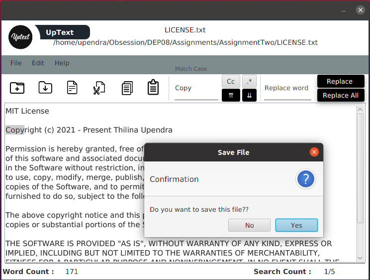

# UpText - Personal Text Editor

## The Repository

This repository is where I have developed the 'UpText' personal text editor as an individual project during my training duration. I have published my full source code in this repository and I will plan to publish my roadmap, monthly iteration plans and long term plans as well. This source code is available to everyone under the standard [MIT licence](./LICENSE.txt).

## UpText 

## License

Copyrights © Thilina Upendra. All rights reserved.

Licensed under the [MIT](./LICENSE.txt) license.

